单值索引,多值索引 取决于查询语句中的参数个数  
**索引两大功能，查找和排序，要记住！！！！！！**

创建方式  
CREATE \[UNIQUE\] INDEX indexName ON mytable(columnname(length))
ALTER mytable ADD \[UNIQUE\] INDEX \[indexName\] ON (columnname(length))

# 哪些应该创建索引  
1. 主键自动建立唯一索引
2. 频繁作为查询条件的字段应该创建索引
3. 查询中与其他表关联的字段，外键关系建立索引
4. 频繁更新的字段不是和创建索引
5. where条件里用不到的字段不创建索引
6. 单键/组合索引的选择问题，在高并发下倾向创建组合索引
7. 查询中排序的字段，排序字段若通过索引去访问将大大提高排序速度
8. 查询中统计或者分组字段

explain sql 执行计划包含的信息  
能够查询出来的表头，要求能够背出来  

* id（决定了一条指令中各个部分的执行顺序）
id	相同，执行顺序由上至下
id	不同，id越大，优先级越高
id	又有不同又有相同，id大的先执行，相同的由上到下
* select_type 
simple 简单的select查询，查询中不包含子查询或者union	
primary 最后加载的，也可以理解是最外层的
subquery 子查询
derived 虚表（将某个查询的结果当作表来使用）
union
union result
* table
derivedX（其中X的序号是id的序号）
* type
最好到最差依次是
system>const>eq_ref>ref>range>index>all
all 表示全表扫描，需要优化！
index 只遍历了索引树，比all好
range 范围查询，这个很好理解
ref 非唯一行索引扫描，返回匹配某个单独值的所有行。本质上也是一种索引访问，它返回所有匹配某个单独值的行，然而，它可能会找到多个符合条件的行，所以他应该属于查找和扫描的混合体
eq_ref （多表）唯一性索引扫描，对于每个索引键，表中只有一条记录与之匹配。常见于主键或唯一索引扫描
const （单表）索引一次就能查到，用于比较primary key 或者unique索引，因为只匹配一行数据，所以很快如将主键置于where列表中，mysql就能将该查询转换为一个常量
system 表只有一行记录
null
* possible_keys 显示可能应用在这张表中的索引，一个或多个，查询涉及到的字段上若存在索引，则该索引将被列出，但不一定被查询实际使用
* key 实际使用的索引。如果为null，则没有使用索引，查询中若使用了覆盖索引，则该索引仅出现在key列表中
* key_len 
* ref 显示索引的哪一列被使用了，可能是个常数
* rows 每张表有多少行被读取，越少越好
* Extra
using filesort 使用外部的索引排序，没有使用索引去排序，这个需要优化
using temporary 新建了一个临时表来保存中间结果，常见order by和group by，这个还有上面这个要特别注意的，多值索引的时候如果用到了order by 和group by这两个字段的话，参数一定也要和索引的数量相同，否则就可能不用索引去排序或者分组了
using index

当存在两个表联查的时候，比如左连接，左表肯定会全查，右表根据条件查，根据条件查的话就意味着是可以优化的，所以右表要建立索引
三表联查同理
**联查时应该尽量用小结果集驱动大的结果集**，比如class left join book，这个class肯定是全遍历的，type是all，而book是可以通过索引查找的，如果class的集合太大，book集合小，那么查索引就达不到理想的效果，如果反过来效率就会增强

# 索引失效的情况
* 全值匹配我最爱？？
* 最佳左前缀法则
如果索引了多列，要遵守最左前缀法则。指的是查询从索引的最左前列开始并且不跳过索引中的列，带头大哥不能死，中间兄弟不能断
* 不再索引列上做任何操作
比如说取字符串指定长度，类型转换
* 存储引擎不能使用索引中范围条件右边的列
范围关键字会导致索引失效，比如between，大于小于，而且会影响多值索引右边列的索引，比如一个多值索引a,b,c，如果b列用了范围就会导致b和c失效
* 尽量使用覆盖索引（只访问索引的查询（索引列和差需un列一致）），减少select *
尽量取索引列中的值，不要取所有的值，这样可以提高查询的效率
* mysql再试永不等于(!=或者<>)的时候无法使用索引会导致全表扫描
这个比较好理解，如果用的 不等于 来判断的话就会逐个扫描
* is null, is not null也无法使用索引
* like以通配符开头('%abc...')mysql索引失效会变成全表扫描的操作
最好在右边加%，否则索引会失效
覆盖索引可以解决左右两边都要%的需求
* 字符串不加单引号索引失效
mysql会自动将数字转换成字符串类型
* 少用or，用它来连接时会索引失效 


# 调优步骤
慢查询的开启并捕获
explain+慢sql分析
show profile 查询sql在mysql服务器里面的执行细节和生命周期情况
sql数据库服务器的参数调优

优化原则：小表驱动大表，即小的数据集驱动大的数据集
`select * from A where id in(select id from B)`
等价于：
```
for select id from B
for select * from A where A.id=b.id
```
当B表的数据集必须小于A表的数据集时，用in优于exists
`select * from A where exists(select 1 from B where B.id=A.id)`
等价于
```
for select * from A
for select * from B where B.id=A.id
```
当A表的数据集系小于B表的数据集系时，用exists优于in。
注意：A表与B表的ID字段应建立索引。
exists子查询只会返回true或false所以子查询select了什么并不重要
其实用in还是exists的概念和join的概念差不多，哪个表要遍历的，一般都是小表，大表一般要它使用索引查询

如果不再索引列上，filesort有两种算法：mysql就要启动双路排序和单路排序，如果sort_buffer的容量大小过小会导致多次创建tmp文件，进而导致多次io，可以通过增大sort_buffer_size或者增大max_length_for_sort_data参数的设置来优化

# 慢查询的设置
查看 `show variables like '%slow_query_log%';`
开启 `set global slow_query_log=1;`
查看时间 `show variables like 'long_query_time%';`
设置时间`set global_long_query_time=3`
mysqldumpslow可以帮忙分析日志
存储函数的信任开启
`show variables like 'log_bin_trust_function_creators'`
`set global log_bin_trust_function_creators=1;`

批量往数据库中插入数据
存储过程不是太熟悉，可以先照葫芦画瓢，定义\$\$作为结束符的原因是防止在定义函数时运行
定义随机字符串
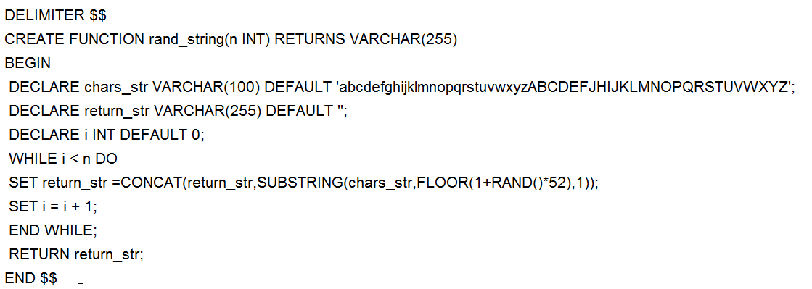
定义随机编号
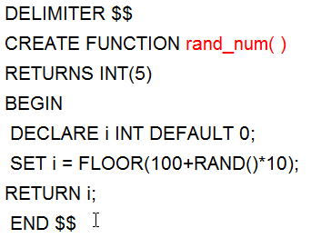
定义员工存储的过程，要把自动提交给关闭否则数据量大的时候每次都提交对服务器有压力
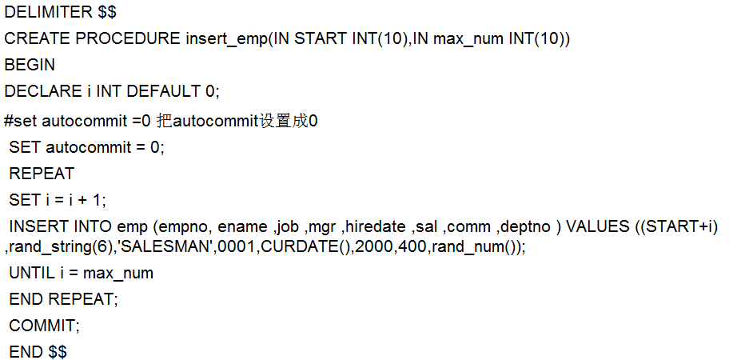
定义部门存储的过程
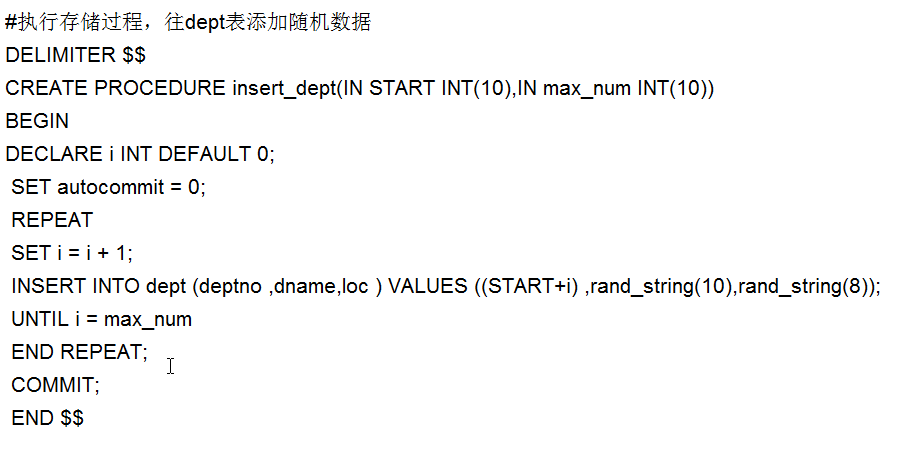
把分割符还原，调用插入的语句
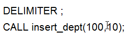
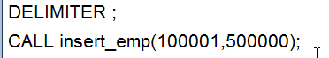

# show profile
默认保存最近15次的运行结果
查看是否支持，然后开启它
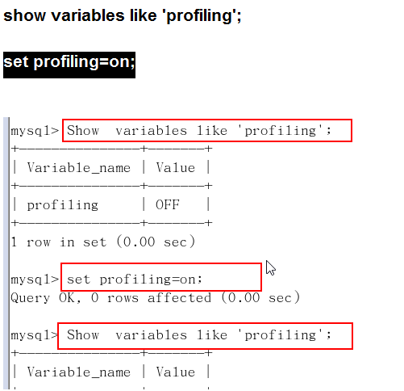
`show profiles;`指令可以查看历史执行指令
可以查看某条指令对电脑资源的占用
`show profile cpu,block io for query 3;`
其余的参数
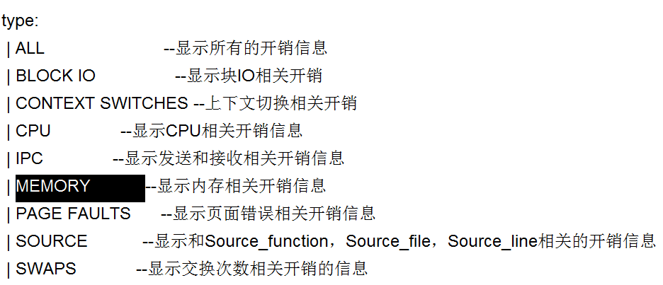
这四个参数出现都需要优化


# 全局查询日志
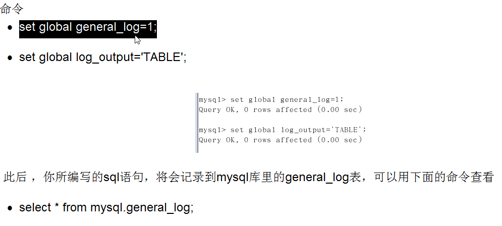

# 锁的机制
从对数据操作的类型
读锁（共享锁）：针对同一份数据，多个读操作可以同时进行而不会互相影响。
写锁（排它锁）：当前写操作没有完成前，它会阻断其他写锁和读锁 

读锁的例子
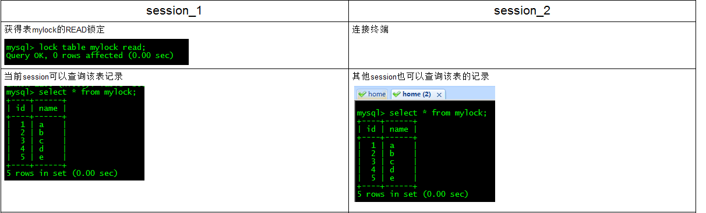
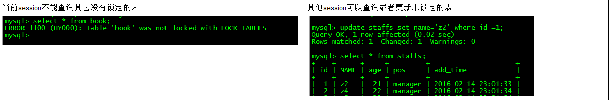
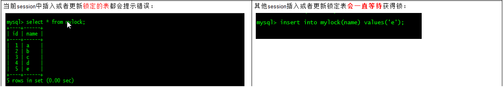
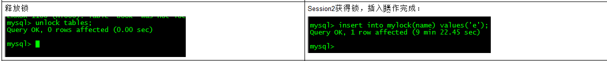

写锁的例子
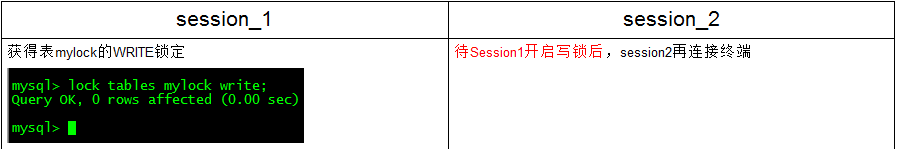
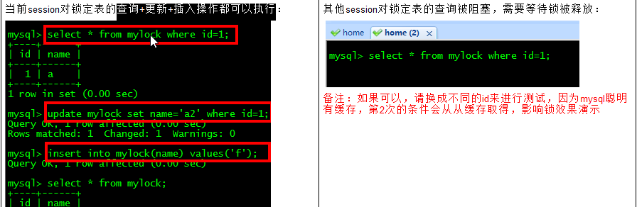
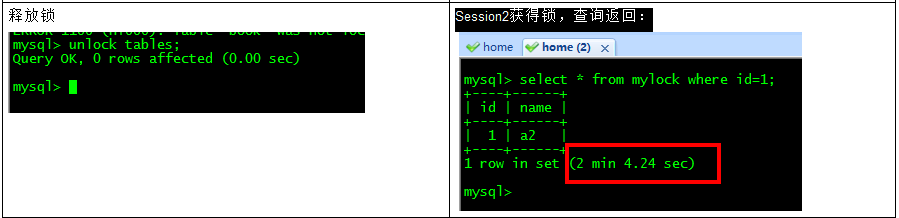

# 主从复制
